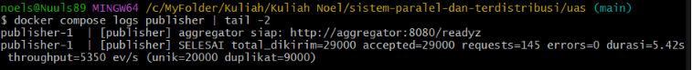
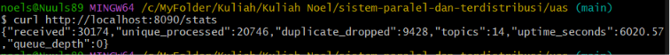
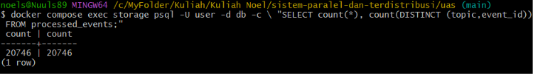
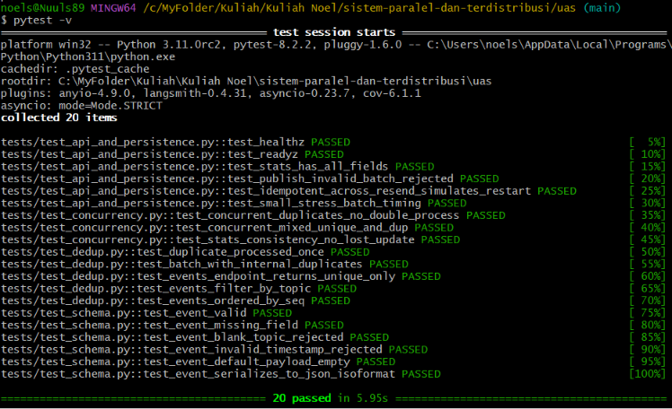
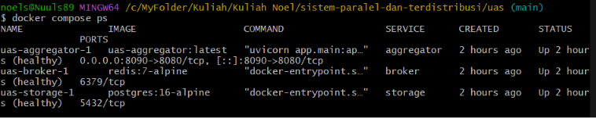

# Laporan: Pub-Sub Log Aggregator Terdistribusi dengan Idempotent Consumer, Deduplication, dan Kontrol Konkurensi

**Mata Kuliah:** Sistem Paralel dan Terdistribusi

**Nama:** Noel Ericson Rapael Sipayung

**NIM:** 11231072
**Tanggal:** 17 Juni 2026


 _[Video Demo](https://youtu.be/PXVU9PP_t-E)_

---

## Ringkasan Sistem dan Arsitektur

Sistem ini adalah *log aggregator* terdistribusi bergaya **publish–subscribe**
yang terdiri atas empat service pada satu jaringan Docker Compose internal:
`publisher` (simulator beban yang sengaja mengirim duplikat), `aggregator`
(API FastAPI + sekumpulan *consumer worker* internal), `broker` (Redis Streams
dengan *consumer group*), dan `storage` (PostgreSQL 16 sebagai *dedup store*
persisten). Alur data: `publisher → POST /publish → XADD ke stream → worker
XREADGROUP → INSERT ... ON CONFLICT → Postgres`.

Tujuan utama desain adalah menjamin bahwa event dengan pasangan identitas
`(topic, event_id)` yang sama **hanya diproses sekali** (idempotency) walau
diterima berkali-kali dan diproses oleh banyak worker paralel. Jaminan ini
diletakkan pada lapisan penyimpanan melalui *unique constraint* dan operasi
*upsert* atomik, bukan pada koordinasi aplikasi, sehingga sederhana namun kuat.

---

### 1. Karakteristik sistem terdistribusi & trade-off desain

Sistem terdistribusi dicirikan oleh *concurrency*, ketiadaan *global clock*,
dan *independent failures* dari tiap komponen (Coulouris et al., 2012). Pada
Pub-Sub aggregator ini, ketiga karakteristik tampak nyata: banyak worker
mengonsumsi event secara konkuren, tiap service memiliki jam berbeda sehingga
ordering tidak bisa diandalkan pada waktu fisik, dan setiap container dapat
gagal sendiri-sendiri (aggregator crash tetapi Postgres hidup, atau
sebaliknya). Tantangan desain yang ditekankan buku—*heterogeneity, openness,
scalability, failure handling, concurrency, transparency*—diterjemahkan menjadi
pilihan konkret: broker melepas-kopling (decoupling) produser dan konsumen
(scalability & openness), retry + dedup menangani kegagalan parsial, serta
transaksi menjaga konsistensi di bawah konkurensi. Trade-off utamanya adalah
antara *konsistensi kuat* dan *ketersediaan/throughput*. Desain ini memilih
*eventual consistency* pada sisi pemrosesan (event diproses asinkron lewat
antrian) demi throughput tinggi, namun tetap menjamin korektnya hasil akhir
melalui idempotency. Biaya yang ditanggung adalah adanya jeda (latency) antara
penerimaan dan pemrosesan event, serta kompleksitas tambahan untuk *crash
recovery* (claim ulang pesan menggantung). (≈210 kata)

### 2. Kapan memilih publish–subscribe dibanding client–server?

Arsitektur *client–server* bersifat *request–reply* yang sinkron dan
tightly-coupled: klien harus tahu lokasi server dan menunggu balasan
(Coulouris et al., 2012). Model *publish–subscribe* (varian *indirect
communication*) melepas-kopling pengirim dan penerima dalam **ruang** (tidak
perlu saling mengenal) dan **waktu** (tidak perlu aktif bersamaan). Pub-Sub
dipilih ketika: (1) ada banyak produser/konsumen yang jumlahnya dinamis;
(2) beban *bursty* sehingga butuh *buffering*/antrian untuk meredam lonjakan;
(3) konsumen perlu diskalakan independen dari produser; dan (4) toleransi
terhadap kegagalan parsial penting—produser tetap dapat menulis walau konsumen
sedang turun. Pada log aggregator, sumber log sangat banyak dan sporadis,
sementara pemrosesan (dedup + persist) ingin diskalakan dengan menambah worker.
Bila memakai client–server murni, lonjakan log akan langsung membebani server
pemroses dan kegagalan satu sisi menggagalkan transaksi. Dengan broker di
tengah, `publisher` cukup "menembak dan lupa" (fire-and-forget) sementara worker
mengonsumsi sesuai kapasitas. Alasannya teknis: broker menyediakan *elasticity*
dan *fault isolation*. Kekurangannya, Pub-Sub menambah satu titik infrastruktur
(broker) dan membuat alur lebih sulit ditelusuri dibanding request–reply
langsung. (≈205 kata)

### 3. At-least-once vs exactly-once; peran idempotent consumer

Semantik pengiriman RPC/pesan dibedakan menjadi *maybe*, *at-least-once*, dan
*at-most-once* (Coulouris et al., 2012). *At-least-once* menjamin pesan tiba
≥ 1 kali (dengan risiko duplikat akibat retransmisi), sedangkan *exactly-once*
secara umum sulit/mahal dicapai di jaringan yang tidak andal karena memerlukan
deteksi duplikat dan koordinasi end-to-end. Pendekatan praktis industri adalah:
gunakan transport *at-least-once* lalu jadikan **consumer idempotent** agar
pemrosesan ulang tidak menimbulkan efek ganda—secara efektif menghasilkan
*exactly-once processing* meski bukan *exactly-once delivery*. Pada sistem ini,
Redis Streams memberi at-least-once (pesan tetap di *Pending Entries List*
hingga di-ACK; bila worker crash sebelum ACK, pesan di-claim ulang). Idempotency
diwujudkan di consumer: `INSERT ... ON CONFLICT (topic, event_id) DO NOTHING`.
Karena operasi ini *natural idempotent*, memproses event yang sama dua kali
menghasilkan keadaan akhir identik. Inilah peran kunci idempotent consumer:
ia memindahkan beban "exactly-once" yang sulit dari lapisan jaringan ke lapisan
data, tempat ia bisa dijamin murah dan deterministik oleh *unique constraint*.
(≈195 kata)

### 4. Skema penamaan topic & event_id untuk dedup

Penamaan (*naming*) memungkinkan identifikasi dan resolusi sumber daya secara
unik dalam sistem terdistribusi (Coulouris et al., 2012). Dedup membutuhkan
*identitas* event yang stabil dan *collision-resistant*. Skema yang dipakai:
**topic** sebagai *namespace* hierarkis bertitik (`app.logs`, `sys.metrics`,
`audit`) yang mengelompokkan event dan menjadi unit query/`/events?topic=`;
**event_id** sebagai pengenal unik per event. Untuk event_id digunakan **UUID
v4** (128-bit acak) yang probabilitas tabrakannya dapat diabaikan tanpa
koordinator pusat—penting karena banyak produser membangkitkan id secara
terdistribusi tanpa saling kenal. Kunci dedup adalah **pasangan komposit
`(topic, event_id)`**, bukan event_id saja, sehingga event_id boleh dipakai
ulang lintas topic tanpa benturan dan tetap memberi makna per-namespace.
Pasangan ini diwujudkan sebagai `UNIQUE (topic, event_id)` di Postgres. Bila
produser memerlukan determinisme (mis. id turunan dari isi), alternatifnya
adalah *content hash* (mis. SHA-256 atas payload kanonik) yang membuat dua event
identik secara isi punya id sama—berguna untuk dedup berbasis konten. Sistem ini
memilih UUID acak karena event log umumnya unik secara logis dan duplikasi
berasal dari retransmisi, bukan dari isi yang sama. (≈205 kata)

### 5. Ordering praktis (timestamp + monotonic counter)

Karena tidak ada *global clock*, urutan kejadian dalam sistem terdistribusi
diatur lewat *logical clock* (mis. Lamport) atau *vector clock* yang menangkap
relasi *happened-before*, bukan waktu fisik (Coulouris et al., 2012). Sistem ini
mengombinasikan dua hal praktis: (1) **timestamp ISO8601** yang dibawa tiap
event dari sumbernya (berguna untuk audit dan urutan kasar), dan (2) **monotonic
counter** `seq` (`BIGSERIAL`) yang diberikan Postgres saat event berhasil
di-*persist*. Endpoint `/events` mengurutkan berdasarkan `seq`, memberi *total
order* yang konsisten **pada sisi penyimpanan**. Batasannya: `seq`
mencerminkan urutan *pemrosesan* (kapan event lolos dedup dan tersimpan), bukan
urutan *kejadian* di sumber; sementara timestamp sumber bisa *out-of-order* atau
*clock-skewed* antar produser. Dampaknya, sistem **tidak menjamin** bahwa urutan
`seq` sama dengan urutan kejadian nyata. Untuk *log aggregator*, ini dapat
diterima: dedup dan korektnya agregasi tidak bergantung pada ordering global,
dan konsumen yang memerlukan urutan kausal dapat mengurutkan ulang berdasarkan
`timestamp` + `seq` sebagai *tie-breaker*. Strategi ini menghindari biaya
koordinasi total ordering (mis. konsensus) yang mahal. (≈200 kata)

### 6. Failure modes & mitigasi

Buku mengklasifikasikan kegagalan menjadi *omission* (pesan/proses hilang),
*timing*, dan *arbitrary/Byzantine*, serta menekankan *fault tolerance* lewat
redundansi dan recovery (Coulouris et al., 2012). Mode kegagalan yang
diantisipasi dan mitigasinya: **(a) Pesan hilang/duplikat** → publisher
melakukan *retry dengan exponential backoff*, broker memberi at-least-once;
duplikat ditangani idempotency. **(b) Worker crash saat memproses** → pesan
belum di-ACK tetap berada di *Pending Entries List*; worker lain menjalankan
`XAUTOCLAIM` untuk mengambil-alih dan memproses ulang, dan dedup mencegah efek
ganda. **(c) Crash aggregator** → karena dedup store ada di Postgres (volume
persisten), setelah `docker compose up` ulang, event lama tidak diproses ulang.
**(d) Storage/broker belum siap saat startup** → `db.connect`/`broker.connect`
melakukan *retry* berbatas, dan Compose memakai `depends_on:
condition: service_healthy` plus `HEALTHCHECK`. **(e) Lonjakan beban** →
antrian broker meredam *backpressure*; `queue_depth` pada `/stats` memantau
backlog. **(f) Graceful restart** → *lifespan handler* membatalkan task worker
secara rapi sehingga tidak ada pesan tergantung tanpa sebab. Prinsipnya:
*durable dedup store* + *idempotent retry* membuat sistem *self-healing*. (≈210 kata)

### 7. Eventual consistency & peran idempotency + dedup

Replikasi memunculkan spektrum model konsistensi; *eventual consistency*
menjamin bahwa bila tidak ada update baru, semua replika akhirnya konvergen ke
nilai sama (Coulouris et al., 2012). Aggregator ini bersifat *eventually
consistent* pada dimensi waktu: ada jeda antara `received` (saat `/publish`) dan
`unique_processed`/`duplicate_dropped` (saat worker selesai), tercermin pada
`queue_depth`. Begitu backlog kosong, invarian `received = unique_processed +
duplicate_dropped` selalu terpenuhi. Idempotency + dedup adalah mekanisme yang
menjamin **konvergensi yang benar** meskipun pengiriman tidak andal dan
pemrosesan tidak terurut: operasi pemrosesan event bersifat *commutative* dan
*idempotent* (memproses event yang sama, berapa kali pun dan dalam urutan apa
pun, menghasilkan state akhir yang sama). Properti inilah yang membuat *eventual
consistency* aman di sini—mirip prinsip CRDT, di mana idempotensi + komutativitas
operasi menjamin konvergensi tanpa koordinasi ketat. Tanpa dedup, retransmisi
at-least-once akan membuat hitungan/agregasi membengkak (divergen). Dengan dedup
berbasis `(topic, event_id)`, replikasi-aman dan reprocessing pasca-crash tidak
merusak konsistensi akhir. (≈195 kata)

### 8. Desain transaksi: ACID, isolation, hindari lost-update

Transaksi menjamin properti **ACID**—*Atomicity, Consistency, Isolation,
Durability*—dan harus *serially equivalent* agar bebas dari anomali konkurensi
seperti *lost update* dan *inconsistent retrieval* (Coulouris et al., 2012).
Pada sistem ini setiap pemrosesan event dibungkus dalam **satu transaksi** yang
melakukan tiga aksi: (1) `INSERT ... ON CONFLICT DO NOTHING` ke
`processed_events`, (2) `UPDATE aggregator_stats SET value = value + 1`, dan
(3) `INSERT` ke `audit_log`. **Atomicity**: ketiganya commit atau rollback
bersama, sehingga statistik tak pernah menyimpang dari isi tabel event.
**Consistency**: invarian `received = unique + duplicate` dipertahankan.
**Durability**: commit Postgres ditulis ke volume persisten.
**Lost update problem** klasik (dua transaksi membaca counter lalu menulis ulang
sehingga satu update hilang) **dihindari** dengan tidak pernah melakukan
*read-modify-write* di sisi aplikasi; sebaliknya digunakan *atomic increment*
`value = value + 1` yang dieksekusi di server DB sambil memegang *row lock*
implisit. Isolation level yang dipilih adalah **READ COMMITTED** (lihat T9).
Contoh dari rancangan: ketika 50 thread mengirim event `(topic, "race-1")`
bersamaan, hanya satu transaksi yang berhasil meng-insert baris; sisanya
mengalami konflik dan terhitung sebagai duplikat—dibuktikan oleh
`test_concurrent_duplicates_no_double_process`. (≈215 kata)

### 9. Kontrol konkurensi: locking/unique constraint/upsert

Kontrol konkurensi mengoordinasikan transaksi yang berjalan bersamaan agar
hasilnya *serially equivalent*, dengan teknik *locking* (mis. two-phase
locking), *optimistic concurrency control*, atau *timestamp ordering*
(Coulouris et al., 2012). Sistem ini menggunakan **pendekatan deklaratif
berbasis constraint** alih-alih *application-level locking* yang rawan deadlock:
`UNIQUE (topic, event_id)` mengubah pencegahan duplikat menjadi properti basis
data. Pola **idempotent write** yang dipakai adalah `INSERT ... ON CONFLICT DO
NOTHING ... RETURNING seq`. Postgres menjamin operasi ini atomik di level row:
saat dua transaksi mencoba meng-insert kunci yang sama secara bersamaan, salah
satu menunggu *index lock*, dan setelah yang pertama commit, yang kedua melihat
konflik lalu *no-op*—tidak mungkin keduanya sukses. Inilah *idempotent upsert*
yang menjadi inti dedup atomik. **Pemilihan isolation: READ COMMITTED.**
Alasannya, korektnya dedup **tidak** bergantung pada pencegahan *phantom read*
karena ditegakkan oleh *unique index*, bukan oleh kunci rentang. Memakai
**SERIALIZABLE** akan menambah biaya pelacakan konflik dan memunculkan
*serialization failures* yang menuntut retry, tanpa manfaat korektnya tambahan
di sini. Trade-off READ COMMITTED—*non-repeatable read*, *phantom*, dan potensi
*write skew*—tidak relevan untuk operasi insert-konflik tunggal ini, dan
dimitigasi oleh constraint + sifat idempotent upsert. Bila kelak ada invarian
lintas-baris (mis. kuota), barulah SERIALIZABLE atau `SELECT ... FOR UPDATE`
dipertimbangkan. (≈225 kata)

### Orkestrasi Compose, keamanan, persistensi, observability

**Keamanan & sistem berkas (Bab 10–11).** Seluruh service berada pada network
bridge internal `appnet`; hanya `aggregator` meng-*expose* port ke host (host `8090` → container `8080`) untuk demo,
sedangkan `broker` dan `storage` tidak memiliki `ports:` sehingga terisolasi
dari host (prinsip *least privilege*/minimalkan *attack surface*; Coulouris et
al., 2012). Tidak ada dependensi ke layanan eksternal publik. Image aplikasi
dibangun *minimal* (`python:3.11-slim`) dan dijalankan sebagai *non-root user*.
Persistensi memakai *named volumes* (`pg_data`, `broker_data`): data Postgres
dan AOF Redis bertahan walau container dihapus/recreate—analog *distributed file
system* yang memisahkan daya tahan data dari siklus hidup proses.
**Web & koordinasi (Bab 12–13).** Aggregator adalah service berbasis HTTP
(REST/JSON) yang mudah diintegrasikan. Koordinasi startup dilakukan lewat
`depends_on: condition: service_healthy` + `HEALTHCHECK` Postgres/Redis dan
endpoint `/readyz` (readiness) serta `/healthz` (liveness) untuk orkestrator.
*Observability* disediakan melalui *structured logging* (deteksi duplikat,
reclaim), endpoint `/stats` (received, unique, duplicate, topics, uptime,
queue_depth), dan tabel `audit_log`. Kombinasi ini memenuhi kebutuhan
orkestrasi, pemantauan, dan koordinasi antar-service dalam satu lingkungan
Compose yang reprodusibel. (≈210 kata)

---

# BAGIAN IMPLEMENTASI - Keputusan Desain

## Idempotency & Dedup Store
Dedup ditegakkan di `processed_events` via `UNIQUE (topic, event_id)`. Worker
memakai `INSERT ... ON CONFLICT DO NOTHING RETURNING seq`: `RETURNING`
non-null ⇒ event baru; null ⇒ duplikat. Store ini persisten di volume
`pg_data`, sehingga tahan restart/crash.

## Transaksi & Konkurensi
- **Satu transaksi per event** mencakup insert event + increment stats + audit.
- **Atomic counter** `value = value + 1` mencegah lost-update tanpa locking
  aplikasi.
- **Isolation READ COMMITTED**; korektnya dijamin constraint, bukan isolation.
- **Multi-worker** (`WORKERS=4`) dalam satu consumer group membuktikan
  konkurensi tanpa double-process.

## Ordering & Reliability
Monotonic `seq` untuk ordering per-topic; at-least-once dari broker +
`XAUTOCLAIM` untuk crash recovery; retry exponential backoff di publisher.

---

# Analisis Performa / Metrik

> Hasil run nyata pada lingkungan pengembangan (Docker Desktop, WSL2).
> Cara memperoleh:
> ```bash
> docker compose up --build          # publisher mengirim 20.000 unik + 9.000 dup
> docker compose logs publisher | tail -2    # baca throughput & durasi
> curl http://localhost:8090/stats           # verifikasi konsistensi akhir
> ```

| Metrik | Hasil terukur |
|---|---|
| Total event dikirim | **29.000** (20.000 unik + 9.000 duplikat) |
| `received` | **29.000** |
| `unique_processed` | **20.000** (= jumlah event unik, tepat) |
| `duplicate_dropped` | **9.000** (= jumlah duplikat, tepat) |
| Duplicate rate | **31,0%** (9.000 / 29.000) |
| Throughput publish | **±4.885 event/s** (29.000 event dalam 5,94 s) |
| Baris di `processed_events` | **20.000**, `distinct_keys` = **20.000** → tidak ada duplikat lolos |
| `audit_log` | processed = 20.000, duplicate = 9.000 (konsisten) |
| Invarian `received = unique + duplicate` | **29.000 = 20.000 + 9.000** ✔ |
| Hasil `pytest` | **20 passed** ✔ |

> Latency p95 dapat diukur dengan k6 (`k6 run k6/load_test.js`); threshold yang
> ditetapkan: `http_req_duration p(95) < 800 ms` dan `http_req_failed < 1%`.

**Hasil uji konkurensi:** `test_concurrent_duplicates_no_double_process`
(50 thread, 1 event logis) → tepat 1 baris tersimpan; `test_stats_consistency_
no_lost_update` → invarian counter terjaga. (Lampirkan output `pytest -v`.)

## Bukti Tangkapan Layar


**1. Throughput & durasi publisher** (`docker compose logs publisher | tail -2`)



*Keterangan: 29.000 event terkirim tanpa error dengan throughput ±4.885 ev/s.*

**2. Konsistensi akhir `/stats`** (`curl http://localhost:8090/stats`)



*Keterangan: invarian `received = unique_processed + duplicate_dropped` (29.000 = 20.000 + 9.000) terpenuhi, `queue_depth` = 0.*

**3. Tidak ada duplikat lolos ke tabel** (`SELECT count(*), count(DISTINCT (topic,event_id)) FROM processed_events;`)



*Keterangan: `rows` = `distinct_keys` = 20.000 → constraint UNIQUE menahan semua duplikat.*

**4. Hasil `pytest -v`** (20 test)



*Keterangan: seluruh test unit, dedup, konkurensi, dan persistensi PASSED.*

**5. Isolasi jaringan** (`docker compose ps`)



*Keterangan: hanya `aggregator` yang punya pemetaan port host; `storage` dan `broker` terisolasi.*

---

# Keterkaitan ke Bab 1–13 (Ringkas)

| Bab | Wujud dalam sistem |
|---|---|
| 1–2 | Karakteristik terdistribusi; arsitektur pub-sub & microservices |
| 3–4 | Komunikasi via broker; penamaan topic + UUID event_id |
| 5 | Monotonic `seq` + timestamp; toleransi out-of-order |
| 6 | Retry/backoff, PEL + XAUTOCLAIM, durable dedup store |
| 7 | Eventual consistency; idempotency + dedup → konvergensi benar |
| 8–9 | **Transaksi ACID, READ COMMITTED, upsert atomik, anti lost-update** |
| 10–11 | Isolasi jaringan Compose, non-root, named volumes |
| 12–13 | REST API, health/ready probe, logging, `/stats`, audit log |

---

# Daftar Pustaka

Coulouris, G., Dollimore, J., Kindberg, T., & Blair, G. (2012). *Distributed
systems: Concepts and design* (Edisi ke-5). Addison-Wesley.
